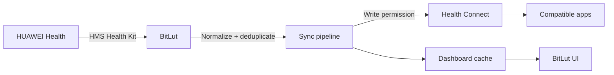

<div align="center">


# BitLut

### Local Huawei Health → Health Connect bridge for Android

**Private by design · Huawei-first · Android 16 ready · No backend**

<p>
  
  
  
  
  
</p>

```text
HUAWEI Health  →  BitLut  →  Android Health Connect  →  compatible apps
```

</div>

---

## What BitLut does

BitLut is a local Android bridge that reads supported activity and workout data from **HUAWEI Health** and writes normalized records to **Android Health Connect**.

There is no BitLut account, cloud backend, advertising layer, or server-side health-data storage. Sync logic runs on-device.

<table>
<tr>
<td width="50%" valign="top">

### Activity

- Steps
- Distance
- Floors / elevation gain
- Calories when available
- Active-time related aggregates used by the dashboard

</td>
<td width="50%" valign="top">

### Workouts

- Exercise sessions
- Session-scoped distance
- Session-scoped steps
- Session-scoped elevation
- Session-scoped active calories
- Huawei device/source metadata

</td>
</tr>
</table>

## Sync architecture



The sync path is intentionally conservative:

- Huawei remains the primary source of activity/workout data.
- Workout type normalization is centralized in `HuaweiWorkoutTypeMapper`.
- Non-workout states are filtered before export.
- Overlapping source sessions are normalized by retaining the richer real source record rather than fabricating clipped timestamps.
- Health Connect writes use deterministic record IDs and stable record versions.
- Exercise sessions and related metrics are written as a coherent bundle.
- Export requires Health Connect **write** permission; dashboard reads depend on **read** permission. Losing an unrelated read permission does not block valid background export.

### Workout fidelity

BitLut prefers Huawei's session-scoped workout metrics. It does **not** reconstruct workout distance from coarse daily Health Connect aggregates.

The only approved derived metric is a documented fallback for total workout calories when Huawei does not provide calories for a real workout, used only for BitLut's own dashboard display and not written to Health Connect. The fallback does not extend to distance, steps, elevation, or other metrics.

## Corporate wellness compatibility

The current interoperability path has been validated with a downstream corporate wellness application reading BitLut-synced workouts through Health Connect. Sync failures were reported again in late August/early September 2026; as a targeted response the per-workout payload was reduced on 2026-09-10 (elevation and total-calories removed) -- not yet a confirmed fix.

The important compatibility contract is that real per-workout distance and steps are written inside the workout's actual time window rather than exposed only as daily aggregates. See [`sync.md`](sync.md) for the full data contract and reliability notes.

## Interface

BitLut uses the **August** design system: Navy, Lime, Tangerine, Purple, Inter Variable, system light/dark themes, restrained glass surfaces, and content-first hierarchy.

Current UI principles:

- flat outlined content cards with restrained depth;
- pill-shaped controls and comfortable touch targets;
- Lime reserved for the primary action;
- tactile spring motion only on interactive controls;
- no decorative bounce on static content;
- bottom navigation with subtle compression, press depth, tilt, and release tremor;
- a persistent high-contrast sync-status capsule that remains visible long enough to perceive in both light and dark themes.

The Settings screen stays intentionally small: data source, connection/sync actions, Health Connect settings, and the steps goal.

## Production stack

<table>
<tr><th align="left">Layer</th><th align="left">Production baseline</th></tr>
<tr><td>Android</td><td>compileSdk 36.1 · targetSdk 36 · minSdk 26</td></tr>
<tr><td>Android Gradle Plugin</td><td>8.13.2</td></tr>
<tr><td>Gradle</td><td>8.13</td></tr>
<tr><td>Kotlin / Compose plugin</td><td>2.3.21</td></tr>
<tr><td>Compose BOM</td><td>2026.06.01</td></tr>
<tr><td>AndroidX Core</td><td>1.18.0</td></tr>
<tr><td>Lifecycle</td><td>2.10.0</td></tr>
<tr><td>Health Connect client</td><td>1.1.0</td></tr>
<tr><td>Huawei AGConnect plugin</td><td>1.9.6.300</td></tr>
<tr><td>Huawei Health Kit</td><td>6.11.0.303</td></tr>
<tr><td>JDK</td><td>17</td></tr>
</table>

This is the newest stable production lane currently used by BitLut without crossing into the API 37 / AGP 9 migration boundary. AGP 9 is treated as a dedicated Huawei-compatibility migration, not a routine dependency bump.

## Build & verification

> [!IMPORTANT]
> **Codespaces local gate:** run structural checks plus `:app:compileDebugKotlin` only. Do not run `assembleDebug` or `lintDebug` locally; full build/lint remains authoritative in GitHub Actions.

### Codespaces

Use only lightweight checks before committing:

```bash
python3 <patch>.py
git diff --check
git status --short
```

Patch scripts must include their own structural/resource verification and must be idempotent and fail-closed.

### GitHub Actions

The release workflow performs the real production gate on a clean runner:

```text
AAR metadata compatibility
        ↓
    lintRelease
        ↓
  assembleRelease
        ↓
 signing + APK verification
        ↓
   release artifact
```

Lint reports are uploaded even when lint fails. A release is considered verified only after the GitHub Actions workflow succeeds.

## Repository guide

| Path | Purpose |
| --- | --- |
| `app/src/main/java/com/openhealth/sync/data/` | Huawei / Health Connect data access and sync storage |
| `app/src/main/java/com/openhealth/sync/domain/` | Sync orchestration |
| `app/src/main/java/com/openhealth/sync/ui/` | Compose UI, dashboard, import and sync state |
| `app/src/main/java/com/openhealth/sync/ui/theme/` | August tokens and theme |
| `app/src/main/java/com/openhealth/sync/widget/` | Home-screen widget |
| `sync.md` | Sync contract and reliability rules |
| `design.md` | August UI decisions |
| `CONTEXT.md` | Long-lived engineering context |
| `SESSION_HANDOFF.md` | Current continuation point for the next coding session |

## Engineering rules

Before changing code, read `CLAUDE.md`, `CONTEXT.md`, `SESSION_HANDOFF.md`, `design.md`, and `sync.md`.

- Preserve working Huawei → Health Connect behavior while changing UI.
- Never suppress lint or create a lint baseline just to make CI green.
- Keep English/Russian string-resource keys in parity.
- Do not infer dead code from a lexical scan alone; search call sites first.
- Keep one-shot patch scripts out of the repository after successful application.
- Prefer small, symptom-based, idempotent patches over broad refactors.
- If historical documentation conflicts with current source plus a successful GitHub Actions run, **current source + green Actions are authoritative**.

---

<div align="center">

**BitLut** · built for reliable local health-data interoperability on Huawei-first Android devices

</div>
